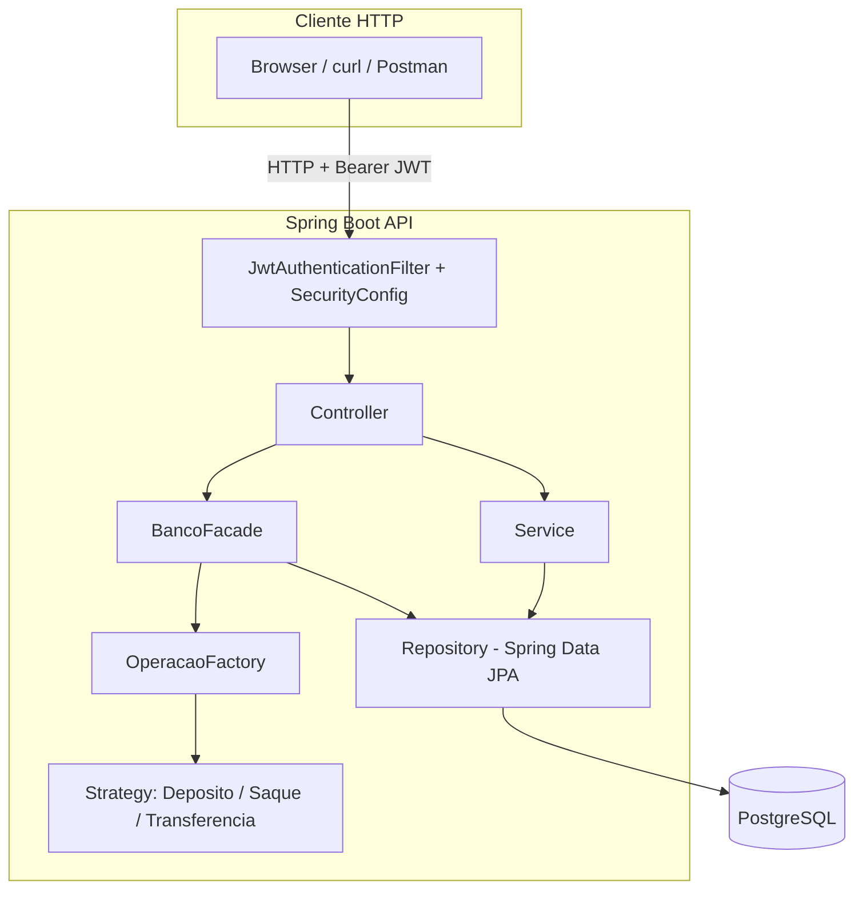

# 04. Arquitetura

## Visão em camadas

## Por que essa organização

A arquitetura segue **Clean Architecture** de forma pragmática (não dogmática): a ideia central é que **regras de negócio não dependem de detalhes de infraestrutura**. Na prática, isso aparece em três decisões:

1. **Controllers são finos.** Eles apenas traduzem HTTP ↔ chamadas de serviço/facade. Nenhuma regra de negócio vive em um `@RestController`.
2. **A lógica de operação bancária vive fora do Service "genérico".** `BancoFacade` orquestra `ContaService` (dono da regra de propriedade) e `OperacaoFactory`/`Strategy` (dono da regra de cálculo de saldo), evitando um `ContaService` inchado com métodos de depósito/saque/transferência misturados com CRUD.
3. **Repositories não sabem de regra de negócio.** Um `ContaRepository` só sabe persistir; ele não decide se um saque pode ou não ser feito.

## Fluxo de uma requisição autenticada

1. O filtro `JwtAuthenticationFilter` intercepta a requisição, valida o Bearer token e popula o `SecurityContext` com o `Usuario` autenticado (que implementa `UserDetails` diretamente).
2. O `SecurityFilterChain` decide, por padrão de URL, se a rota exige um papel específico (`/usuarios/**` → `ADMIN`) ou apenas autenticação (`anyRequest().authenticated()`).
3. O `Controller` correspondente recebe a requisição já autenticada e delega para o `Service` ou `Facade`.
4. Regras de **propriedade de recurso** (ex.: "esta conta pertence a este usuário?") são checadas explicitamente no `Service`/`Facade`, via `SecurityUtils.getUsuarioAutenticado()` — porque isso depende do dado consultado em tempo de execução, e não pode ser expresso apenas com `hasRole(...)` na configuração estática de segurança.
5. Erros de qualquer camada são convertidos para um JSON padronizado pelo `GlobalExceptionHandler`.

## Módulos (pacotes) do backend

Ver `06-backend.md` para o detalhamento pacote a pacote.

## Decisões arquiteturais relevantes

| Decisão | Alternativa considerada | Motivo da escolha |
|---|---|---|
| IDs como UUID (não Long autoincrement) | Long/sequence | Evita enumeração de recursos por ID sequencial; mais alinhado a um domínio "corporativo" |
| `Usuario` implementa `UserDetails` diretamente | Classe adaptadora separada (`UserDetailsImpl`) | Menos indireção para o escopo atual do projeto; reavaliar se o modelo de usuário crescer muito |
| Regra de propriedade no Service, não em `@PreAuthorize` com SpEL | `@PreAuthorize("#id == authentication.principal.id")` | Mais legível e testável isoladamente com Mockito; SpEL complexo é difícil de testar unitariamente |
| Refresh token também é um JWT (stateless) | Refresh token opaco armazenado em banco/Redis | Simplicidade para o MVP; não permite revogação individual de refresh tokens — ver `09-seguranca.md` para o trade-off |
