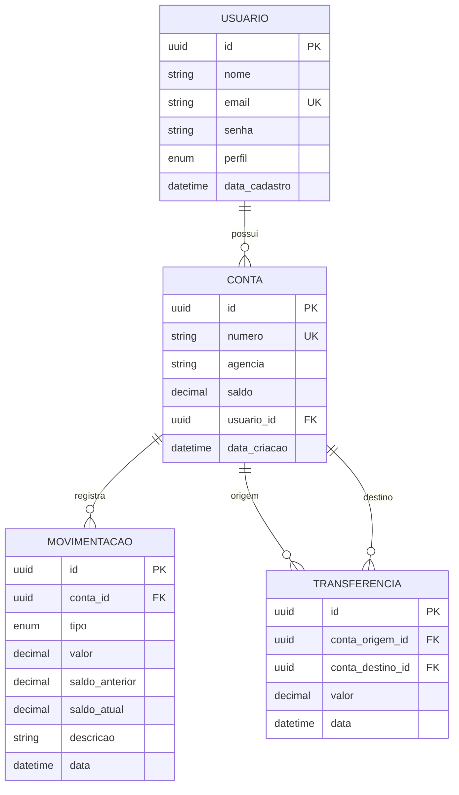

# 05. Modelo de Domínio

## Diagrama de Entidade-Relacionamento

## Usuario

Representa tanto o dono de contas quanto o principal de autenticação — a classe implementa `UserDetails` diretamente (ver `09-seguranca.md`).

| Campo | Tipo | Observações |
|---|---|---|
| `id` | UUID | Gerado via `@UuidGenerator` (Hibernate), não depende de extensão do Postgres |
| `nome` | String | Obrigatório |
| `email` | String | Único; é o *username* usado no login |
| `senha` | String | Hash BCrypt, nunca o valor em texto plano |
| `perfil` | `Perfil` (enum: `ADMIN`, `CLIENTE`) | Define autoridade Spring Security (`ROLE_ADMIN` / `ROLE_CLIENTE`) |
| `dataCadastro` | LocalDateTime | Preenchido automaticamente em `@PrePersist` |

## Conta

| Campo | Tipo | Observações |
|---|---|---|
| `id` | UUID | — |
| `numero` | String | Único; gerado por `NumeroContaGenerator` no formato `NNNNNN-D` |
| `agencia` | String | Informada na criação |
| `saldo` | BigDecimal(19,2) | Nunca fica negativo — validado nas Strategies |
| `usuario` | `Usuario` (ManyToOne) | Dono da conta |
| `dataCriacao` | LocalDateTime | — |

## Movimentacao

Registro imutável de cada operação que afeta o saldo — é o que compõe o extrato.

| Campo | Tipo | Observações |
|---|---|---|
| `tipo` | `TipoMovimentacao` (enum) | `DEPOSITO`, `SAQUE`, `PIX`, `TRANSFERENCIA_ENVIADA`, `TRANSFERENCIA_RECEBIDA` |
| `valor` | BigDecimal(19,2) | Valor da operação (sempre positivo) |
| `saldoAnterior` / `saldoAtual` | BigDecimal(19,2) | Snapshot do saldo antes/depois — permite auditoria sem recalcular histórico |
| `descricao` | String | Texto legível (ex.: "Transferência enviada para conta 200000-2") |

> **Por que guardar `saldoAnterior`/`saldoAtual` em vez de só o delta?** Permite auditar o extrato sem precisar "replay" de todas as movimentações anteriores para saber qual era o saldo em um dado momento — importante em um domínio financeiro onde auditabilidade é requisito, não luxo.

## Transferencia

Registro complementar à `Movimentacao`, representando a transferência como uma entidade de negócio própria (útil para relatórios "todas as transferências", independente do extrato por conta).

| Campo | Tipo | Observações |
|---|---|---|
| `contaOrigem` / `contaDestino` | `Conta` (ManyToOne) | Nunca podem ser a mesma conta (validado em `TransferenciaStrategy` e no banco via `CHECK constraint`) |
| `valor` | BigDecimal(19,2) | — |

## Por que Transferencia E Movimentacao (duas tabelas para uma operação)?

Uma transferência gera **uma linha em `Transferencia`** (o evento de negócio) e **duas linhas em `Movimentacao`** (o efeito em cada conta: débito na origem, crédito no destino). Essa duplicação é intencional: `Movimentacao` responde "o que aconteceu com esta conta ao longo do tempo" (o extrato), enquanto `Transferencia` responde "quais transferências existiram entre quais contas" — perguntas diferentes, tabelas diferentes.
