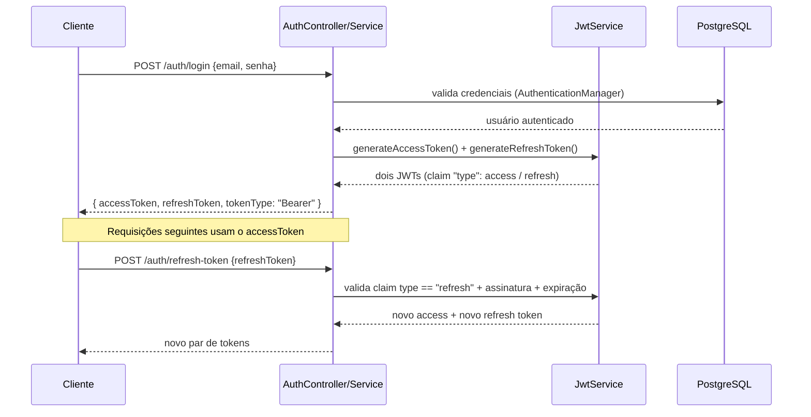

# 09. Segurança

## Autenticação: JWT com access + refresh token



Ambos os tokens são JWTs assinados com a **mesma chave HMAC-SHA256**, diferenciados por um claim `"type"` (`"access"` ou `"refresh"`). Isso evita ter que gerenciar duas chaves/algoritmos diferentes, mantendo o `JwtService` simples.

- **Access token**: expira em 15 minutos por padrão (`app.jwt.access-token-expiration-ms`).
- **Refresh token**: expira em 7 dias por padrão (`app.jwt.refresh-token-expiration-ms`).

### Trade-off consciente: refresh token stateless

Como o refresh token não é armazenado em banco (é validado apenas pela assinatura e expiração), **não é possível revogar um refresh token individualmente** antes de sua expiração natural (ex.: em caso de logout forçado ou dispositivo comprometido). Para o escopo atual do projeto isso é aceitável; uma evolução futura seria manter uma *deny list* de refresh tokens revogados (Redis seria um bom candidato — ver módulos avançados em `02-visao-geral.md`).

## Hashing de senha

Todas as senhas são armazenadas via `BCryptPasswordEncoder` (fator de custo padrão do Spring Security). Nunca há log, retorno de API ou serialização do valor em texto plano — mesmo o próprio hash nunca é incluído em nenhum DTO de resposta (`UsuarioResponse` não tem campo `senha`).

## Autorização em duas camadas

### 1. RBAC (Role Based Access Control) — estático

Configurado em `SecurityConfig`, baseado no papel do usuário (`ROLE_ADMIN` / `ROLE_CLIENTE`):

```java
.requestMatchers(PUBLIC_ENDPOINTS).permitAll()
.requestMatchers("/usuarios/**").hasRole("ADMIN")
.anyRequest().authenticated()
```

### 2. Autorização por propriedade de recurso — dinâmica

Não é possível expressar "só o dono desta conta pode acessá-la" apenas com regras estáticas de URL, porque isso depende do **dado** (quem é o dono da conta X), não da rota. Essa checagem vive em `ContaService.validarPropriedade(Conta)`:

```java
void validarPropriedade(Conta conta) {
    Usuario usuarioLogado = SecurityUtils.getUsuarioAutenticado();
    boolean admin = usuarioLogado.getPerfil() == Perfil.ADMIN;
    boolean dono = conta.getUsuario().getId().equals(usuarioLogado.getId());
    if (!admin && !dono) {
        throw new AccessDeniedException("Você não tem permissão para acessar esta conta");
    }
}
```

Essa exceção é convertida em **403 Forbidden** pelo `GlobalExceptionHandler` (quando lançada dentro do fluxo normal da aplicação) — importante notar que uma `AccessDeniedException` lançada pelo próprio Spring Security no nível do filtro (RBAC estático) é tratada pelo mecanismo padrão do Security, não pelo nosso handler; ambas resultam em 403 de qualquer forma.

> ⚠️ Nota de implementação: `AccessDeniedException`, quando o usuário está autenticado como "anônimo" (sem token, ou token inválido), pode retornar 401 em vez de 403 — esse foi um bug real encontrado durante os testes de integração deste projeto (ver `12-testes.md`), causado por um problema de URL nos próprios testes, não da lógica de autorização em si.

## CORS

Configurado via `CorsConfig`, com origem permitida parametrizável (`CORS_ALLOWED_ORIGINS`, padrão `http://localhost:4200` pensando no futuro frontend Angular).

## Bootstrap do primeiro ADMIN

Como `/usuarios` é ADMIN-only, existe um problema de "ovo e galinha": quem cria o primeiro ADMIN? Resolvido pelo `AdminBootstrapRunner`, um `ApplicationRunner` que roda na subida da aplicação e cria um ADMIN padrão **apenas se nenhum ADMIN existir ainda** no banco. Credenciais configuráveis via `ADMIN_BOOTSTRAP_EMAIL`/`ADMIN_BOOTSTRAP_SENHA`; pode ser desligado com `ADMIN_BOOTSTRAP_ENABLED=false` (e é desligado por padrão no profile de testes, para não interferir nos cenários de teste que criam seus próprios usuários).
