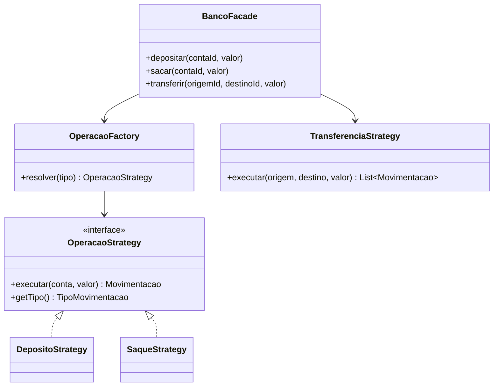

# 11. Design Patterns (GoF) Aplicados

Cada padrão abaixo foi escolhido para resolver um problema concreto do domínio bancário — não como exercício isolado. Esta seção mostra o **problema**, a **solução** e um trecho real do código.

## Strategy

**Problema**: depósito e saque afetam o saldo de uma única conta, mas com regras diferentes (saque valida saldo suficiente; depósito não valida nada). Um `if/else` cresceria a cada novo tipo de operação (PIX, por exemplo).

**Solução**: uma interface comum, uma implementação por tipo de operação.

```java
public interface OperacaoStrategy {
    Movimentacao executar(Conta conta, BigDecimal valor);
    TipoMovimentacao getTipo();
}

@Component
public class SaqueStrategy implements OperacaoStrategy {
    @Override
    public Movimentacao executar(Conta conta, BigDecimal valor) {
        if (conta.getSaldo().compareTo(valor) < 0) {
            throw new BusinessException("Saldo insuficiente para realizar o saque");
        }
        // ... aplica o débito e retorna a Movimentacao
    }
}
```

`TransferenciaStrategy` **não** implementa essa interface — ela afeta duas contas simultaneamente (débito na origem, crédito no destino), um contrato diferente o suficiente para justificar sua própria classe em vez de forçar uma interface genérica demais.

## Factory Method

**Problema**: alguém precisa decidir, em tempo de execução, qual `OperacaoStrategy` usar para um dado `TipoMovimentacao`, sem espalhar `if (tipo == DEPOSITO) ... else if (tipo == SAQUE) ...` pelo código.

**Solução**: `OperacaoFactory` recebe todas as `OperacaoStrategy` via injeção de dependência do Spring (`List<OperacaoStrategy>`) e as indexa por tipo:

```java
@Component
public class OperacaoFactory {
    private final Map<TipoMovimentacao, OperacaoStrategy> estrategias;

    public OperacaoFactory(List<OperacaoStrategy> strategies) {
        this.estrategias = strategies.stream()
                .collect(Collectors.toMap(OperacaoStrategy::getTipo, Function.identity()));
    }

    public OperacaoStrategy resolver(TipoMovimentacao tipo) {
        OperacaoStrategy strategy = estrategias.get(tipo);
        if (strategy == null) {
            throw new BusinessException("Tipo de operação não suportado: " + tipo);
        }
        return strategy;
    }
}
```

Adicionar um novo tipo de operação (ex.: PIX) exigirá apenas criar uma nova classe `@Component implements OperacaoStrategy` — o Spring a registra automaticamente no mapa, **sem alterar `OperacaoFactory`**. Isso é o princípio Aberto/Fechado (o "O" do SOLID) na prática.

## Facade

**Problema**: uma operação bancária de verdade envolve múltiplos passos coordenados — buscar a conta, validar propriedade, resolver a strategy correta, persistir conta e movimentação, tudo dentro de uma transação. Se essa orquestração vivesse espalhada no Controller, ele ficaria acoplado a detalhes de `OperacaoFactory`, `ContaRepository`, `MovimentacaoRepository` etc.

**Solução**: `BancoFacade` concentra essa orquestração, expondo uma API simples (`depositar`, `sacar`, `transferir`, `extrato`) para os controllers:

```java
@Transactional
public ContaResponse depositar(UUID contaId, BigDecimal valor) {
    return aplicarOperacaoSimples(contaId, valor, TipoMovimentacao.DEPOSITO);
}

private ContaResponse aplicarOperacaoSimples(UUID contaId, BigDecimal valor, TipoMovimentacao tipo) {
    Conta conta = contaService.buscarEntidadePorId(contaId);
    contaService.validarPropriedade(conta);
    Movimentacao movimentacao = operacaoFactory.resolver(tipo).executar(conta, valor);
    contaRepository.save(conta);
    movimentacaoRepository.save(movimentacao);
    return contaMapper.toResponse(conta);
}
```

O Controller não sabe (nem precisa saber) que existe uma Factory ou Strategies por trás — só conhece a Facade.

## Singleton

**Problema clássico do GoF**: garantir uma única instância de uma classe.

**Como aparece aqui**: não implementamos Singleton manualmente — o **Spring IoC Container** já aplica esse padrão por padrão (escopo `singleton` é o default de todo `@Component`, `@Service`, `@Repository`). Cada `Service`, `Repository`, `Strategy` e `Factory` deste projeto é, na prática, um Singleton gerenciado pelo container, sem precisar de código boilerplate (construtor privado, `getInstance()` etc.).

## Builder

**Como aparece aqui**: via Lombok `@Builder` em todas as entidades (`Usuario`, `Conta`, `Movimentacao`, `Transferencia`), permitindo construção fluida e legível:

```java
Movimentacao.builder()
        .conta(conta)
        .tipo(TipoMovimentacao.DEPOSITO)
        .valor(valor)
        .saldoAnterior(saldoAnterior)
        .saldoAtual(saldoAtual)
        .descricao("Depósito em conta")
        .build();
```

## Mapper (não-GoF, mas relevante)

MapStruct gera, em tempo de compilação, as implementações de conversão `Entity ↔ DTO`, evitando código manual repetitivo e propenso a erro:

```java
@Mapper(componentModel = "spring")
public interface ContaMapper {
    @Mapping(target = "usuarioId", source = "usuario.id")
    @Mapping(target = "usuarioNome", source = "usuario.nome")
    ContaResponse toResponse(Conta conta);
}
```

## Diagrama: Strategy + Factory + Facade juntos


