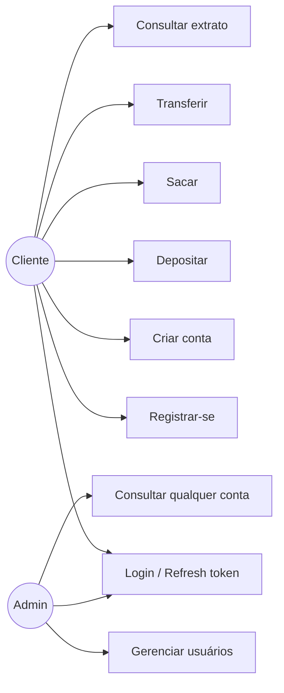

# 14. Casos de Uso

## Diagrama geral

## UC01 — Registrar-se

- **Ator**: Visitante (não autenticado).
- **Pré-condição**: e-mail ainda não cadastrado.
- **Fluxo principal**:
  1. Visitante envia nome, e-mail e senha para `POST /auth/register`.
  2. Sistema valida os campos (Bean Validation) e verifica unicidade do e-mail.
  3. Sistema cria o usuário com perfil `CLIENTE` e senha criptografada (BCrypt).
  4. Sistema retorna access token + refresh token.
- **Fluxo alternativo**: e-mail já existe → `409 Conflict`, nenhum usuário é criado.

## UC02 — Autenticar-se / Renovar sessão

- **Ator**: Usuário cadastrado (CLIENTE ou ADMIN).
- **Fluxo principal (login)**: credenciais corretas → `200` com novo par de tokens.
- **Fluxo alternativo**: credenciais incorretas → `401`, nenhuma informação sobre qual campo está errado (mitigação contra enumeração de e-mails cadastrados).
- **Fluxo principal (refresh)**: refresh token válido e não expirado → novo par de tokens, sem precisar reenviar senha.

## UC03 — Criar conta

- **Ator**: Usuário autenticado.
- **Pré-condição**: usuário titular (`usuarioId`) deve existir.
- **Fluxo principal**: sistema gera um número de conta único, vincula ao usuário titular, saldo inicial zero.

## UC04 — Depositar

- **Ator**: Dono da conta.
- **Pré-condição**: usuário autenticado é o dono da conta (ou ADMIN).
- **Fluxo principal**: valor é somado ao saldo; uma `Movimentacao` do tipo `DEPOSITO` é registrada com snapshot do saldo antes/depois.
- **Fluxo alternativo**: usuário não é dono da conta → `403 Forbidden`.

## UC05 — Sacar

- **Ator**: Dono da conta.
- **Pré-condição**: saldo disponível ≥ valor solicitado.
- **Fluxo principal**: valor é subtraído do saldo; `Movimentacao` do tipo `SAQUE` registrada.
- **Fluxo alternativo**: saldo insuficiente → `422 Unprocessable Entity`, nenhuma alteração é persistida.

## UC06 — Transferir

- **Ator**: Dono da conta de origem.
- **Pré-condição**: conta de origem pertence ao usuário autenticado; conta de destino existe e é diferente da origem; saldo de origem ≥ valor.
- **Fluxo principal**:
  1. Sistema debita a conta de origem e credita a conta de destino, na mesma transação.
  2. Registra duas movimentações (`TRANSFERENCIA_ENVIADA` na origem, `TRANSFERENCIA_RECEBIDA` no destino) e um registro em `Transferencia`.
- **Observação**: a conta de destino **não** precisa pertencer ao usuário autenticado — é assim que uma transferência para terceiros funciona. A checagem de propriedade se aplica só à origem.
- **Fluxo alternativo**: origem não pertence ao usuário → `403`; saldo insuficiente ou origem == destino → `422`.

## UC07 — Consultar extrato

- **Ator**: Dono da conta (ou ADMIN).
- **Fluxo principal**: retorna página de movimentações ordenadas da mais recente para a mais antiga.

## UC08 — Gerenciar usuários (ADMIN)

- **Ator**: ADMIN.
- **Fluxo principal**: CRUD completo sobre qualquer usuário do sistema, incluindo definir o perfil (`ADMIN`/`CLIENTE`).
- **Restrição**: apenas usuários com `ROLE_ADMIN` acessam `/usuarios/**` — CLIENTE recebe `403`.

## UC09 — Consultar qualquer conta (ADMIN)

- **Ator**: ADMIN.
- **Fluxo principal**: `GET /contas` retorna todas as contas do sistema (não apenas as do ADMIN), já que a regra de propriedade é relaxada para esse perfil.
