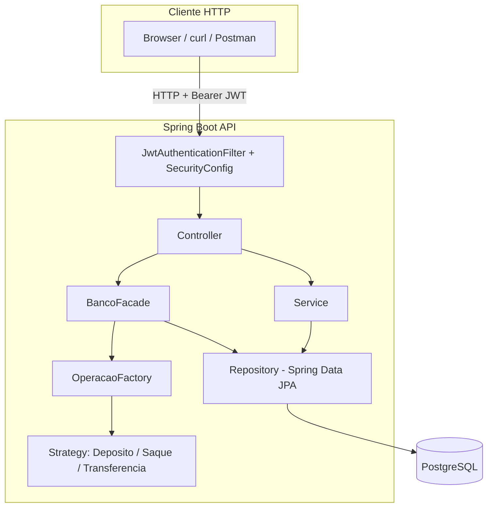
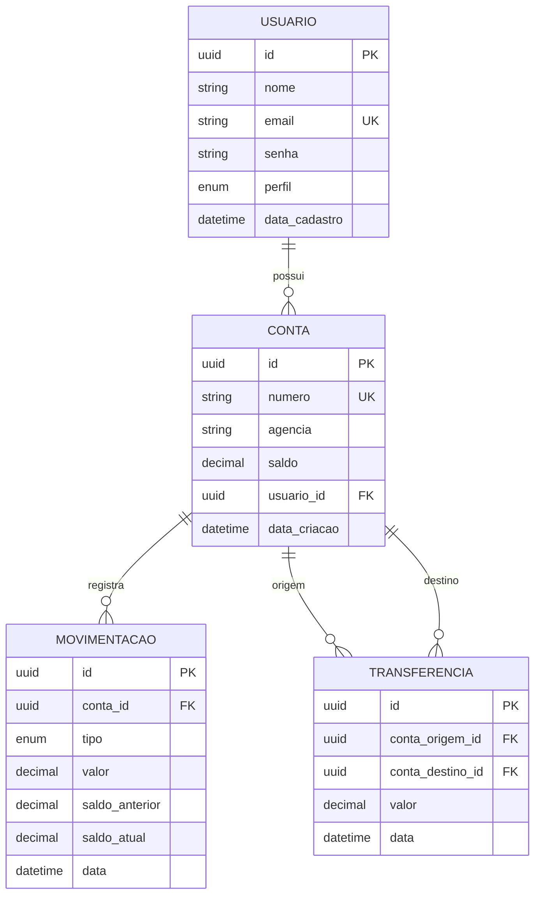
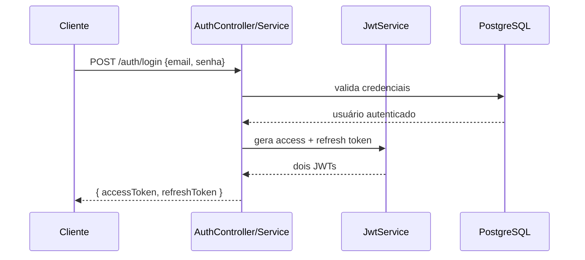
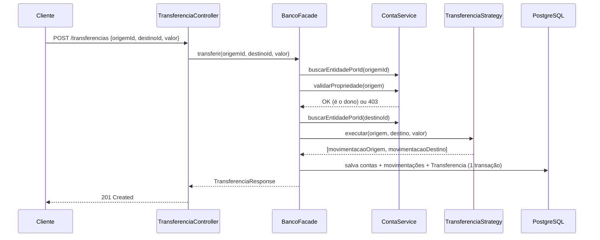
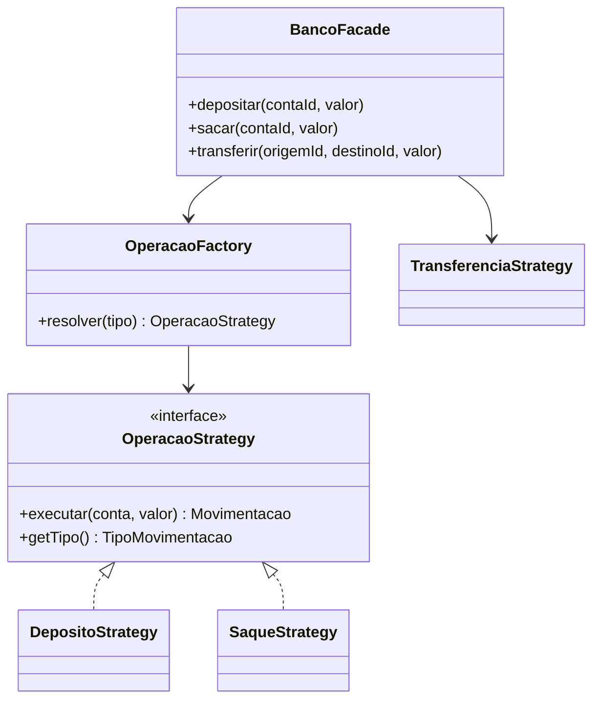
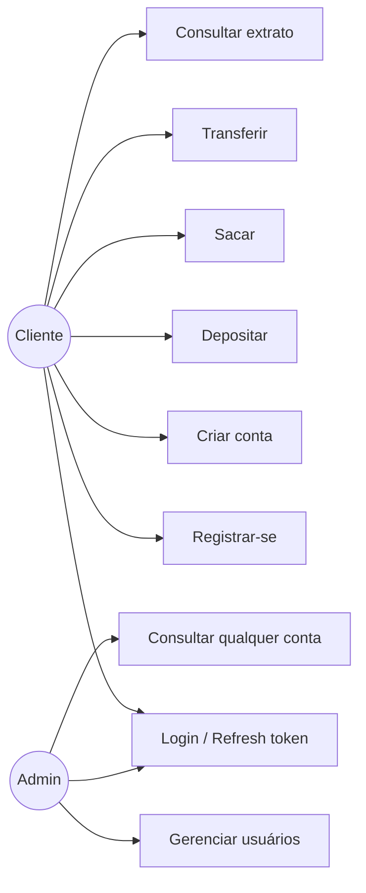

# 15. Diagramas

Esta página consolida os diagramas já apresentados nos demais documentos, para consulta rápida em um único lugar. Todos são renderizados nativamente pelo GitHub (Mermaid).

## Arquitetura em camadas

Ver `04-arquitetura.md` para a explicação completa do fluxo.

## Modelo de dados (ER)

Ver `05-modelo-dominio.md` para a descrição campo a campo.

## Sequência: login com JWT

Ver `09-seguranca.md` para os detalhes de expiração e claims.

## Sequência: transferência entre contas

## Design patterns: Strategy + Factory + Facade

Ver `11-design-patterns.md` para o código real por trás deste diagrama.

## Casos de uso

Ver `14-casos-de-uso.md` para a descrição textual de cada fluxo.

